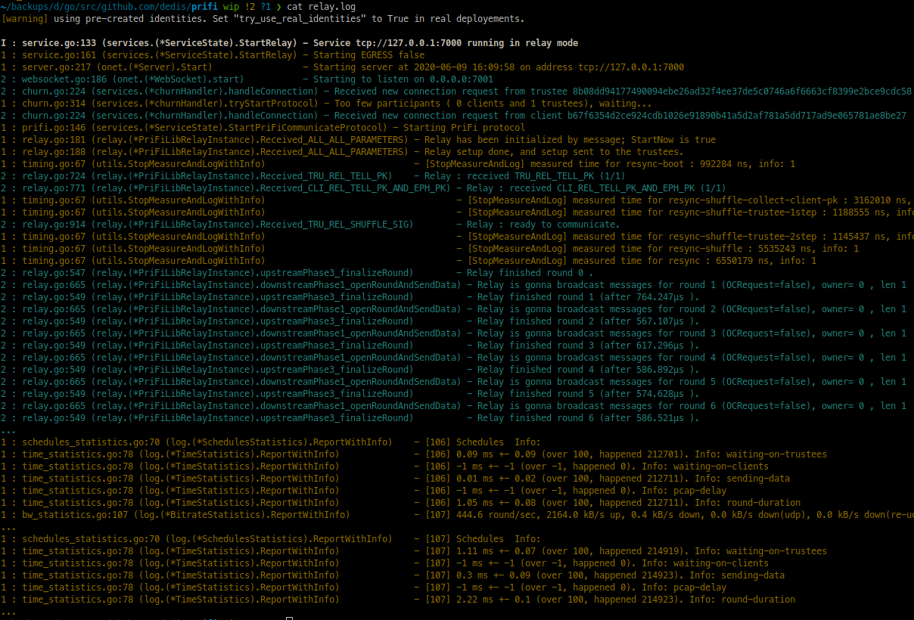

# PriFi: A Low-Latency, Tracking-Resistant Protocol for Local-Area Anonymity [](https://travis-ci.org/dedis/prifi) [](https://goreportcard.com/report/github.com/dedis/prifi) [](https://coveralls.io/github/dedis/prifi?branch=master)

## Introduction


This repository implements PriFi, an anonymous communication protocol with provable traffic-analysis resistance and small latency suitable for wireless networks. PriFi provides a network access mechanism for protecting members of an organization who access the Internet while on-site (via privacy-preserving WiFi networking) and while off-site (via privacy-preserving virtual private networking or VPN). The small latency cost is achieved by leveraging the client-relay-server topology common in WiFi networks. The main entities of PriFi are: relay, trustee server (or Trustees), and clients. These collaborate to implement a Dining Cryptographer's network ([DC-nets](https://en.wikipedia.org/wiki/Dining_cryptographers_problem)) that can anonymize the client upstream traffic. The relay is a WiFi router that can process normal TCP/IP traffic in addition to running our protocol.

For an extended introduction, please check our [website](https://prifi.net/).

For more details about PriFi, please check our [paper](https://arxiv.org/abs/1710.10237).


**Warning: This software is experimental and still under development. Do not use it yet for security-critical purposes. Use at your own risk!**

## Getting PriFi

First, [get the Go language](https://golang.org/dl/), >= 1.13

Then, get PriFi by doing:

```
go get github.com/dedis/prifi/sda/app
cd $GOPATH/src/github.com/dedis/prifi
make install
```

## Running PriFi

### Configuration

PriFi uses [ONet](https://github.com/dedis/onet) as a network framework. It is easy to run all components (trustees, relay, clients) on one machine for testing purposes, or on different machines for the real setup.

Each component (relay/client/trustee) has an *ONet configuration* : an identity (`identity.toml`, containing a private and public key), and some knowledge of the others participants via `group.toml`. For your convenience, we pre-generated some identities in `config/identities_default`.

### Automated Testing, all components in localhost

Travis should have made these check for you; current status: [](https://travis-ci.org/dedis/prifi)

What is tested:
- `make test`: Go tests for all important modules + Go style (fmt/lint)
- `make it`: Integration tests with multiple configurations, no data (simply tests that the PriFi network runs)
- `make it2`: Integration tests with multiple configurations + GET request to google.com through PriFi

All-in-one test (tests all 16 configurations in `config/`, takes 5min):
```bash
$ make it2

This test check that PriFi's clients, trustees and relay connect and start performing communication rounds, and that a Ping request can go through (back and forth).
Gonna test with config/prifi-integration-dummydown-test.toml
Socks proxy not running, starting it...[ok]
Starting relay...                      [ok]
Starting trustee 0...                  [ok]
Starting client 0... (SOCKS on :8081)  [ok]
Starting client 1... (SOCKS on :8082)  [ok]
Starting client 2... (SOCKS on :8083)  [ok]
Waiting 20 seconds...
Doing SOCKS HTTP request via :8081...   [ok]
Doing SOCKS HTTP request via :8082...   [ok]
Doing SOCKS HTTP request via :8083...   [ok]
Test succeeded
...
```

Running only the "main" configuration (takes 20 seconds):
```
$ ./test.sh integration2 config/prifi.toml

This test check that PriFi's clients, trustees and relay connect and start performing communication rounds, and that a Ping request can go through (back and forth).
Gonna test with config/prifi.toml
Socks proxy not running, starting it...[ok]
Starting relay...                      [ok]
Starting trustee 0...                  [ok]
Starting client 0... (SOCKS on :8081)  [ok]
Starting client 1... (SOCKS on :8082)  [ok]
Starting client 2... (SOCKS on :8083)  [ok]
Waiting 20 seconds...
Doing SOCKS HTTP request via :8081...   [ok]
Doing SOCKS HTTP request via :8082...   [ok]
Doing SOCKS HTTP request via :8083...   [ok]
Test succeeded
All tests passed.
```

### Manual Testing, all components in localhost

You can test PriFi by running `./prifi.sh all-localhost`. This will run a SOCKS server, a PriFi relay, a Trustee, and three clients on your machine. They will use the identities in `config/identities_default`.
 
You can check what is going on by doing `tail -f {clientX|relay|trusteeX|socks}.log`.



You can test browsing through PriFi by setting your browser to use a SOCKS proxy on `localhost:8081`, or with `curl`:

```curl -w "@curl_format.cnf" --socks5 127.0.0.1:8080 --max-time 10 "http://google.com/"```

### Running PriFi manually, entity by entity

Move to `$GOPATH/src/github.com/dedis/prifi`, and open 5 terminals as follows:
 
 

Run in order the following commands:
- `./prifi.sh trustee 0`
- `./prifi.sh relay`
- `cd socks && ./run-socks-proxy.sh`
- `./prifi.sh client 0`
- and, after a while `curl -w "@curl_format.cnf" --socks5 127.0.0.1:8080 --max-time 10 "http://google.com/"`

The result should look like [this](screenshots/manual-run2.png).

### Using PriFi in a real setup

To test a real PriFi deployement, first, re-generates your identity (so your private key is really private). The processed is detailed in the [README about ./prifi.sh startup script](README_prifi.sh.md).

## More documentation :

 - [README about the Architecture and SOCKS Proxies](README_architecture.md)

 - [README about ./prifi.sh startup script](README_prifi.sh.md)

 - [README about contributing to this repository](README_contributing.md)
 
## Reproducing experiments

You need a [Deterlab](http://deterlab.net/) account, which needs to be setup in [the following config file](sda/simulation/deter.toml).

In Deterlab, deploy [the following topology](sda/simulation/deter.ns).

Then, simply run `./simul.sh simul`; as you can see in `simul.sh`, there are dozen of commands to regenerate the various graphs, e.g., `simul-vary-nclients`, ` simul-skype`, etc.

## Reproducing graphs

Experiments produce raw log files; then, they are processed into graph using some scripts. This happens in [this other repo](https://github.com/lbarman/prifi-experiments), where all raw logs & resulting graphics have been preserved for reproducibility.